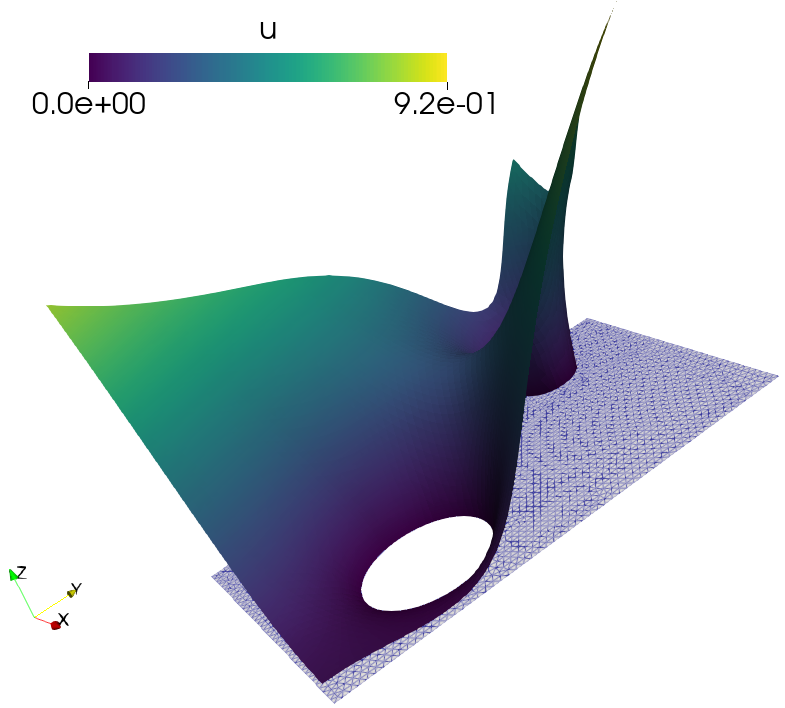

# nonlinear_poisson_equation.ipynb
[nonlinear_poisson_equation.ipynb](nonlinear_poisson_equation.ipynb) file shows how to write fenics code step-by-step to solve the nonlinear Poisson equation. It also shows the implementation of Newton and Picard iteration methods.

# results
Contains the output of poisson test that you can visualize in paraview. `.pvd` file contains the list of all simulation file that you can open in paraview. Alternatively, you can directly open `.vtu` file in paraview. 

Plot of the solution of the nonlinear Poisson equation:

