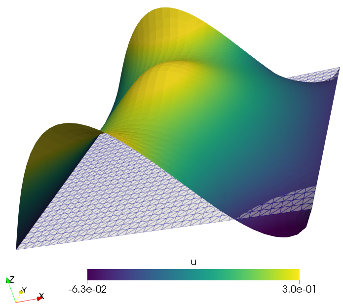
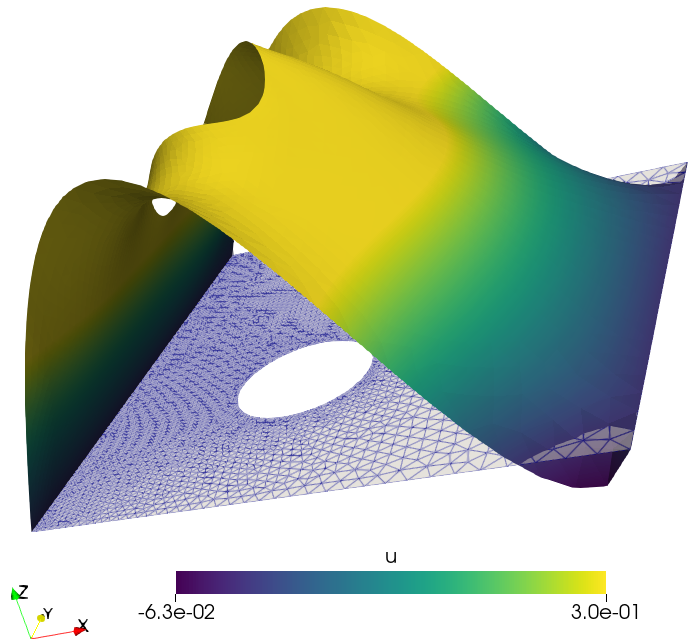

# poisson_equation.ipynb
[poisson_equation.ipynb](poisson_equation.ipynb) file shows how to write fenics code step-by-step to solve the Poisson equation. It also shows how to load the mesh in fenics and solve the same equation on complex domains. 

# results
Contains the output of poisson test that you can visualize in paraview. `.pvd` file contains the list of all simulation file that you can open in paraview. Alternatively, you can directly open `.vtu` file in paraview. 

Result for the first example:

Result for the second example:

